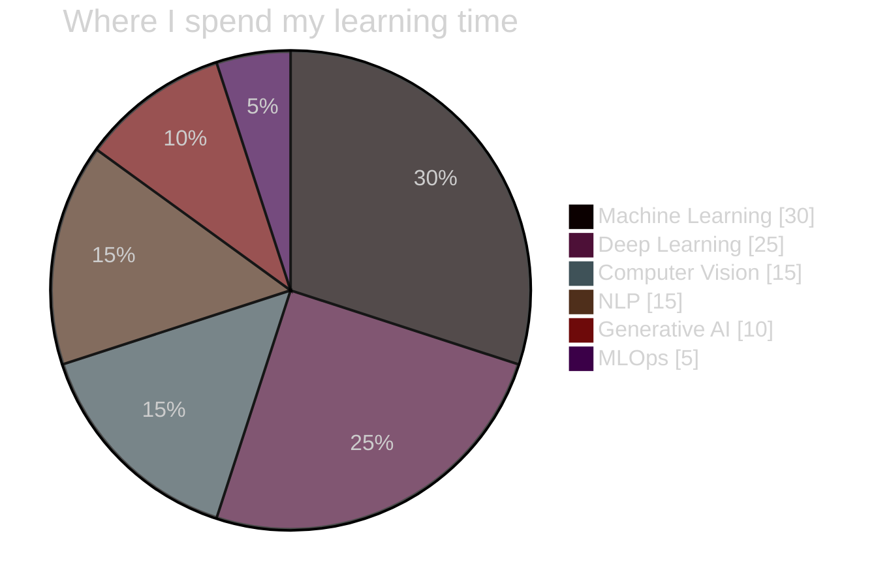
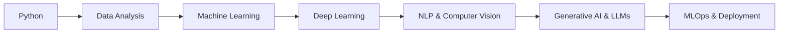

<!-- ============ HEADER BANNER ============ -->
<div align="center">


<a href="https://github.com/krunalsinhdev">
  
</a>

<br/>


<br/><br/>

<a href="mailto:krunalsinh.dev@gmail.com"></a>
<a href="https://www.linkedin.com/in/YOUR-LINKEDIN-USERNAME"></a>
<a href="https://github.com/krunalsinhdev"></a>
<a href="https://www.kaggle.com/YOUR-KAGGLE-USERNAME"></a>
<a href="https://instagram.com/YOUR-INSTAGRAM-USERNAME"></a>

</div>

<br/>

---

## 👨‍💻 About Me

<table>
<tr>
<td width="60%">

```python
class Krunalsinh:
    def __init__(self):
        self.name       = "Krunalsinh Dodiya"
        self.role       = "AIML Developer"
        self.education  = "B.E. Computer Science Engineering"
        self.location   = "Gujarat, India 🇮🇳"
        self.focus      = ["Machine Learning", "Deep Learning",
                           "Computer Vision", "NLP"]
        self.learning   = ["Generative AI", "LLMs", "MLOps"]
        self.currently  = "Building AI projects & growing my skills"

    def motto(self):
        return "Learn. Build. Improve. Repeat. 🔁"
```

</td>
<td width="40%">

- 🔭 Currently working on **AI/ML projects**
- 🌱 Learning **Deep Learning, LLMs & Generative AI**
- 🤝 Open to **collaborations & internships**
- 💬 Ask me about **Python, ML, Data Science**
- ⚡ Fun fact: I turn coffee ☕ into code

</td>
</tr>
</table>

---

## 🛠️ Tech Stack

<div align="center">

### 💻 Languages


### 🤖 AI / ML / Data Science


### 🌐 Frameworks & Tools


### 🗄️ Databases & Cloud


</div>

### 📐 Skill Proficiency

```text
Python            ████████████████░░░░  80%
Machine Learning  ██████████████░░░░░░  70%
Deep Learning     ████████████░░░░░░░░  60%
Computer Vision   ███████████░░░░░░░░░  55%
NLP               ██████████░░░░░░░░░░  50%
Generative AI     ████████░░░░░░░░░░░░  40%
MLOps             ██████░░░░░░░░░░░░░░  30%
```

### 🥧 My Focus Areas



---

## 🧊 3D Contribution Calendar

## 🧊 3D Contribution Calendar

<div align="center">
  
  <br/>
  
  
</div>

## 📊 GitHub Analytics Dashboard

<div align="center">


<br/>

### 🔥 Contribution Streak


### 📈 Activity Graph


</div>

---

## ⏱️ Coding Activity (WakaTime)

> Create a free account at [wakatime.com](https://wakatime.com), install the plugin in VS Code, then make your profile public in *Settings → Profile → "Display coding activity publicly"*. Replace `YOUR-WAKATIME-USERNAME` below.

<div align="center">


<br/>


</div>

---

## 🚀 Featured Projects

> 💡 Replace `REPO-NAME` with your real repository names. Cards update automatically.

<div align="center">
<table>
<tr>
<td>
<a href="https://github.com/krunalsinhdev/REPO-NAME-1">
  
</a>
</td>
<td>
<a href="https://github.com/krunalsinhdev/REPO-NAME-2">
  
</a>
</td>
</tr>
<tr>
<td>
<a href="https://github.com/krunalsinhdev/REPO-NAME-3">
  
</a>
</td>
<td>
<a href="https://github.com/krunalsinhdev/REPO-NAME-4">
  
</a>
</td>
</tr>
</table>
</div>

### 🗂️ Project Details

| Project | What it does | Tech | Links |
|:--|:--|:--|:--|
| 🤖 **Project One** | Short description of your ML / AI project and the problem it solves |   | [Code](https://github.com/krunalsinhdev/REPO-NAME-1) · [Demo](#) |
| 👁️ **Project Two** | Computer vision / image classification project |   | [Code](https://github.com/krunalsinhdev/REPO-NAME-2) · [Demo](#) |
| 💬 **Project Three** | NLP / chatbot / sentiment analysis project |   | [Code](https://github.com/krunalsinhdev/REPO-NAME-3) · [Demo](#) |
| 📈 **Project Four** | Data analysis / dashboard with Streamlit |   | [Code](https://github.com/krunalsinhdev/REPO-NAME-4) · [Demo](#) |

---

## 🎓 Certifications & Achievements

<div align="center">

| Certification | Issuer | Year | Credential |
|:--|:--|:-:|:-:|
| 🧠 Machine Learning Specialization | Coursera · DeepLearning.AI | 2025 | [View](#) |
| 🐍 Python for Data Science | IBM / NPTEL | 2025 | [View](#) |
| ☁️ Cloud Practitioner Essentials | AWS | 2026 | [View](#) |
| 🤖 Generative AI Fundamentals | Google Cloud | 2026 | [View](#) |

<br/>


</div>

> ✏️ Edit the table with your real certificates and add the credential links.

---

## 🏆 GitHub Trophies

<div align="center">
  
</div>

---

## 🐍 Contribution Snake

<div align="center">
  <picture>
    <source media="(prefers-color-scheme: dark)" srcset="https://raw.githubusercontent.com/krunalsinhdev/krunalsinhdev/output/github-snake-dark.svg" />
    <source media="(prefers-color-scheme: light)" srcset="https://raw.githubusercontent.com/krunalsinhdev/krunalsinhdev/output/github-snake.svg" />
    
  </picture>
</div>

---

## 📂 More About Me (click to expand)

<details>
<summary><b>🎯 Goals for 2026</b></summary>
<br/>

- [x] Create my GitHub profile 🎉
- [ ] Build **5+ AI/ML projects** and publish them
- [ ] Learn **Generative AI & LLM fine-tuning**
- [ ] Participate in **Kaggle competitions**
- [ ] Contribute to **open-source projects**
- [ ] Land an **AI/ML internship**

</details>

<details>
<summary><b>📚 Learning Roadmap</b></summary>
<br/>



</details>

<details>
<summary><b>🎓 Education</b></summary>
<br/>

**B.E. in Computer Science Engineering** (AI & ML focus)
📍 Gujarat, India · 🗓️ 2023 – 2027 *(edit with your details)*

</details>

<details>
<summary><b>📖 Currently Reading / Learning</b></summary>
<br/>

- Hands-On Machine Learning with Scikit-Learn, Keras & TensorFlow
- Deep Learning Specialization
- Hugging Face course (LLMs & Transformers)

</details>

<details>
<summary><b>🧰 Dev Setup</b></summary>
<br/>

- 💻 Editor: VS Code
- 🐍 Python 3.x, Jupyter, Anaconda
- 🐧 OS: Windows / Linux
- 🔧 Tools: Git, Docker, Postman

</details>

---

## 💬 Quote of the Day

<div align="center">
  
</div>

---

## 🤝 Let's Connect

<div align="center">

I'm always open to **collaborations, internships, and learning opportunities**.
Feel free to reach out. Let's build something amazing together! 🚀

📧 **krunalsinh.dev@gmail.com**

<br/>

⭐ *If you like my profile, consider giving a star to my repositories!* ⭐


</div>
